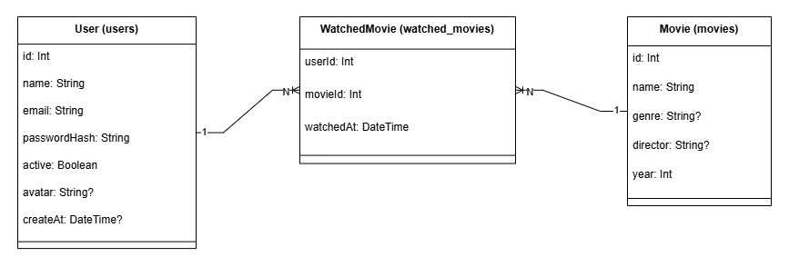
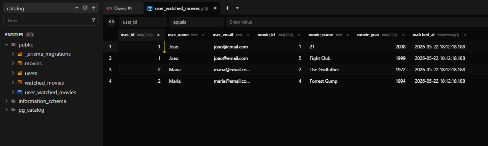
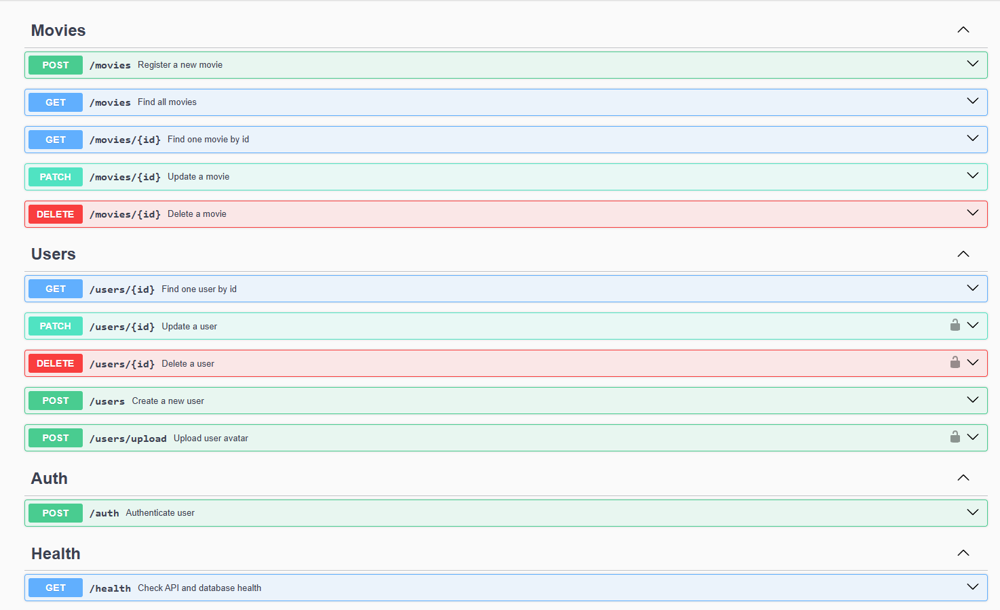

# 🎬 Movie Catalog API

A RESTful API for managing movies and users, built with NestJS and TypeScript. Users can register, authenticate, browse movies, and track which ones they've watched.

[](https://github.com/brunocmg/movie-catalog-api/blob/main/LICENSE)
[](https://nestjs.com/)
[](https://www.typescriptlang.org/)
[](https://www.postgresql.org/)
[](https://www.prisma.io/)
[](https://www.docker.com/)

---

## 📋 Table of Contents

- [Overview](#-overview)
- [Features](#-features)
- [Tech Stack](#-tech-stack)
- [Database Schema](#-database-schema)
- [Getting Started](#-getting-started)
- [Environment Variables](#-environment-variables)
- [API Documentation](#-api-documentation)
- [Running Tests](#-running-tests)
- [License](#-license)

---

## 📖 Overview

Movie Catalog API allows you to:

- **Create and manage movies** with full CRUD operations
- **Register and manage users** with secure authentication
- **Assign watched movies to users**, creating a relationship between entities
- **Authenticate** using JWT with access and refresh tokens

---

## ✨ Features

- ✅ Full CRUD for movies and users
- ✅ JWT authentication with refresh token
- ✅ Password hashing with bcrypt
- ✅ Access control and role-based guards
- ✅ Role-based access control (admin/user)
- ✅ DTO validation with class-validator and class-transformer
- ✅ Pagination on list endpoints
- ✅ Global exception handling
- ✅ Logging with interceptors
- ✅ API documentation with Swagger
- ✅ Health check endpoint
- ✅ Database seed
- ✅ Unit and E2E tests
- ✅ Docker support
- ✅ ESLint + Prettier

---

## 🛠 Tech Stack

| Technology | Purpose |
|---|---|
| NestJS | Framework |
| TypeScript | Language |
| Prisma | ORM |
| PostgreSQL | Database |
| JWT | Authentication |
| bcrypt | Password hashing |
| Jest | Testing |
| Swagger | API documentation |
| Docker | Containerization |
| class-validator | DTO validation |
| class-transformer | Data transformation |

---

## 🗄 Database Schema

> Entity relationship diagram



> Beekeeper Studio — database view



---

## 🚀 Getting Started

### Prerequisites

- [Node.js](https://nodejs.org/) >= 20
- [Docker](https://www.docker.com/) and Docker Compose

### 1. Clone the repository

```bash
git clone https://github.com/brunocmg/movie-catalog-api.git
cd movie-catalog-api
```

### 2. Configure environment variables

```bash
cp .env.example .env
```

Fill in the values in `.env` (see [Environment Variables](#-environment-variables)).

### 3. Start with Docker

```bash
docker compose up --build
```

The API will be available at `http://localhost:3000`.

### 4. Run the seed (optional)

```bash
docker compose exec api npx prisma db seed
```
or (whitout docker)
```bash
npx prisma db seed
```

---

## 🔐 Environment Variables

To run this project locally, you will need to add the following environment variables to your `.env` file. You can copy the structure below:

```env
# Database Configuration
DB_USER=postgres
DB_PASSWORD=your_db_password
DB_NAME=catalog
DB_HOST=db
DB_PORT=5432
DATABASE_URL="postgresql://postgres:your_db_password@db:5432/catalog"

# JWT Authentication
JWT_SECRET=your_jwt_secret_key
JWT_TOKEN_AUDIENCE=http://localhost:3000
JWT_TOKEN_ISSUER=http://localhost:3000
JWT_TTL="30d"

# Application Settings
UPLOAD_DIR=./files
PRISMA_GENERATE=true
NODE_ENV=development
PORT=3000
```

---

## 📚 API Documentation

Swagger UI is available at:

```
http://localhost:3000/docs
```

> Swagger UI preview



### Main endpoints

| Method | Endpoint | Description | Auth |
|---|---|---|---|
| POST | `/auth` | Login and get tokens | ❌ |
| GET | `/movies` | List all movies (paginated) | ❌ |
| POST | `/movies` | Create a movie | ✅ |
| GET | `/movies/:id` | Get movie by ID | ❌ |
| PATCH | `/movies/:id` | Update a movie | ✅ |
| DELETE | `/movies/:id` | Delete a movie | ✅ |
| GET | `/users/:id` | Get user by ID | ✅ |
| POST | `/users` | Create a user | ❌ |
| PATCH | `/users/:id` | Update a user | ✅ |
| DELETE | `/users/:id` | Delete a user | ✅ |
| POST | `/users/upload` | Upload user avatar | ✅ |
| GET | `/health` | Health check | ❌ |

---

## 📁 Project Structure

```
src/
├── main.ts
├── app/
├── auth/
├── users/
├── movies/
├── prisma/
├── health/
└── common/
    ├── filters/
    ├── guards/
    ├── interceptors/
    └── middlewares/
```

## 🧪 Running Tests

```bash
# Unit tests
npm run test

# E2E tests
npm run test:e2e

# Coverage
npm run test:cov
```

---

## 🌐 Deploy

Live API: https://movie-catalog-api-54m7.onrender.com/docs

---

## 📄 License

This project is licensed under the [MIT License](./LICENSE).
