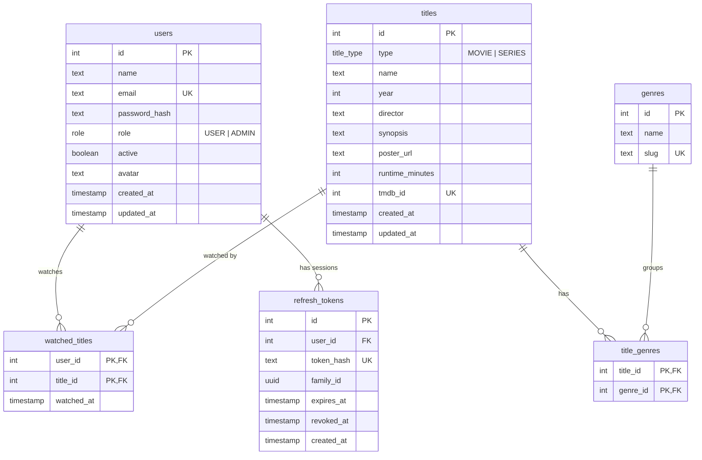
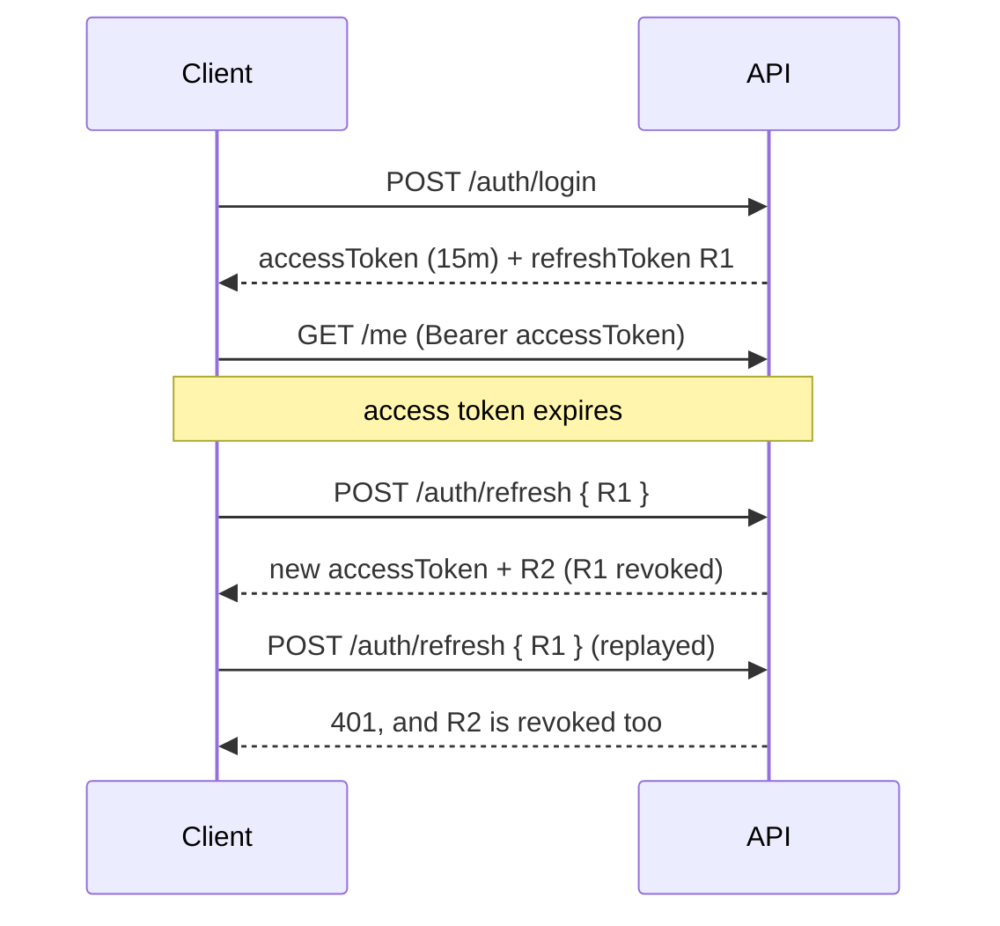
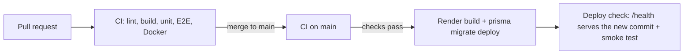

# 🎬 Movie Catalog API

A RESTful API for managing a movie catalog and its users, built with NestJS and TypeScript. Users can register, authenticate, browse movies and track which ones they've watched.

[](https://github.com/brunocmg/movie-catalog-api/actions/workflows/ci.yml)
[](https://github.com/brunocmg/movie-catalog-api/actions/workflows/deploy-check.yml)
[](./LICENSE)
[](https://nestjs.com/)
[](https://www.typescriptlang.org/)
[](https://www.postgresql.org/)
[](https://www.prisma.io/)
[](https://www.docker.com/)

---

## 📋 Table of Contents

- [Features](#-features)
- [Tech Stack](#-tech-stack)
- [Database Schema](#-database-schema)
- [Getting Started](#-getting-started)
- [Environment Variables](#-environment-variables)
- [API Documentation](#-api-documentation)
- [Running Tests](#-running-tests)
- [CI](#-ci)
- [Roadmap](#-roadmap)
- [License](#-license)

---

## ✨ Features

- ✅ Movies and series share one `titles` model (type, runtime, synopsis, poster, genres); movies CRUD with pagination, writes restricted to admins
- ✅ Genres as a table, created on the fly when a title is saved
- ✅ User registration, update, deletion and avatar upload (JPEG/PNG, max 3 MB)
- ✅ JWT access tokens (15 min) + opaque refresh tokens with rotation, reuse detection and logout
- ✅ Password hashing with bcrypt
- ✅ Role-based access control (`USER` / `ADMIN`) with `@Auth()` / `@Roles()` and ownership checks
- ✅ Case-insensitive e-mails (normalized to lower case)
- ✅ Audit timestamps (`created_at` / `updated_at`) and snake_case columns
- ✅ Generic login error and constant-time comparison to avoid user enumeration
- ✅ Guard that re-checks on every request that the user still exists and is active
- ✅ DTO validation with class-validator / class-transformer
- ✅ Consistent error responses: 403/404/409 where they belong, no database details leaked, unexpected errors logged with stack trace
- ✅ Structured JSON logs (pino) with a request id per request, echoed in `X-Request-Id` and in error bodies
- ✅ Security headers (helmet), configurable CORS and rate limiting (stricter on login and sign-up)
- ✅ Environment validated at boot: the app refuses to start with a clear message
- ✅ Swagger / OpenAPI documentation
- ✅ Health check with database probe
- ✅ Idempotent database seed
- ✅ Unit and E2E tests (E2E boot the real `AppModule` with the production pipes and filters)
- ✅ Multi-stage Docker image (runs `prisma migrate deploy` on start)
- ✅ GitHub Actions CI (lint, build, unit, E2E with Postgres, Docker build)

---

## 🛠 Tech Stack

| Technology | Purpose |
|---|---|
| NestJS 11 | Framework |
| TypeScript | Language |
| Prisma 7 | ORM and migrations |
| PostgreSQL 15 | Database |
| JWT | Authentication |
| bcrypt | Password hashing |
| Jest + Supertest | Unit and E2E tests |
| Swagger | API documentation |
| Docker / Compose | Containerization |
| GitHub Actions | Continuous integration |

---

## 🗄 Database Schema


```mermaid
erDiagram
  users ||--o{ watched_titles : watches
  titles ||--o{ watched_titles : "watched by"
  titles ||--o{ title_genres : has
  genres ||--o{ title_genres : groups
  users ||--o{ refresh_tokens : "has sessions"
  users {
    int id PK
    text name
    text email UK
    text password_hash
    role role "USER | ADMIN"
    boolean active
    text avatar
    timestamp created_at
    timestamp updated_at
  }
  titles {
    int id PK
    title_type type "MOVIE | SERIES"
    text name
    int year
    text director
    text synopsis
    text poster_url
    int runtime_minutes
    int tmdb_id UK
    timestamp created_at
    timestamp updated_at
  }
  genres {
    int id PK
    text name
    text slug UK
  }
  title_genres {
    int title_id PK,FK
    int genre_id PK,FK
  }
  watched_titles {
    int user_id PK,FK
    int title_id PK,FK
    timestamp watched_at
  }
  refresh_tokens {
    int id PK
    int user_id FK
    text token_hash UK
    uuid family_id
    timestamp expires_at
    timestamp revoked_at
    timestamp created_at
  }
```

---

## 🚀 Getting Started

### Prerequisites

- [Node.js](https://nodejs.org/) 24
- [Docker](https://www.docker.com/) and Docker Compose

### 1. Clone the repository

```bash
git clone https://github.com/brunocmg/movie-catalog-api.git
cd movie-catalog-api
```

### 2. Configure environment variables

```bash
cp .env.example .env
```

Fill in the values in `.env` (see [Environment Variables](#-environment-variables)).

### 3a. Run with Docker (recommended)

```bash
docker compose up --build
```

Compose waits for Postgres to be healthy, applies the migrations and starts the API in watch mode (hot reload) at `http://localhost:3000`.

> After changing dependencies, recreate the container with fresh `node_modules`: `docker compose up --build -V app`.

Seed the database (optional). It creates sample movies, two users (`joao@email.com` / `123456`, `maria@email.com` / `123456`) and an admin (`admin@email.com` / `admin123`):

```bash
docker compose exec app npx prisma db seed
```

### 3b. Run locally (without Docker for the API)

```bash
docker compose up -d db
npm install
npx prisma migrate deploy
npx prisma db seed   # optional
npm run start:dev
```

> When running outside Docker, `DATABASE_URL` must point to `localhost` instead of `db`.

### Production image

```bash
docker build --target prod -t movie-catalog-api .
docker run --env-file .env -p 3000:3000 movie-catalog-api
```

---

## 🔐 Environment Variables

All variables are validated when the app starts ([env.validation.ts](./src/config/env.validation.ts)). A missing or invalid value stops the boot with a message listing every problem. See [.env.example](./.env.example).

| Variable | Required | Default | Description |
|---|---|---|---|
| `DATABASE_URL` | ✅ | | `postgresql://` connection string |
| `JWT_SECRET` | ✅ | | At least 32 characters (`openssl rand -base64 48`) |
| `JWT_TOKEN_AUDIENCE` / `JWT_TOKEN_ISSUER` | ✅ | | JWT `aud` / `iss` claims |
| `JWT_TTL` | ✅ | | Access token lifetime: `900` (seconds), `15m`, `1h` |
| `JWT_REFRESH_TTL` | | `7d` | Refresh token lifetime |
| `NODE_ENV` | | `development` | `development`, `production` or `test` |
| `PORT` | | `3000` | HTTP port |
| `RENDER_GIT_COMMIT` | | | Set by Render; shown as `commit` in `/health` |
| `LOG_LEVEL` | | `info` | `fatal`, `error`, `warn`, `info`, `debug`, `trace` or `silent` |
| `SWAGGER_ENABLED` | | `true` | Serve the docs at `/docs` |
| `CORS_ORIGINS` | | | `*` or a comma-separated list. Unset: any origin in development, disabled in production |
| `TRUST_PROXY` | | `0` | Proxies in front of the app (`1` on Render), so rate limiting sees the real IP |
| `THROTTLE_TTL_MS` | | `60000` | Rate-limit window |
| `THROTTLE_LIMIT` | | `100` | Requests per window, any route |
| `THROTTLE_AUTH_LIMIT` | | `5` | Login / sign-up attempts per window |

`DB_USER`, `DB_PASSWORD` and `DB_NAME` are only used by docker compose to create the database.

For E2E tests, create a `.env.test` with the same JWT variables and a `DATABASE_URL` pointing to a **separate** database — the tests wipe every table.

---

## 📚 API Documentation

Swagger UI is available at `http://localhost:3000/docs`.


### Endpoints

Access: 🌐 public · 👤 any authenticated user · 🙋 own account only · 🛡️ admin

| Method | Endpoint | Description | Access |
|---|---|---|---|
| POST | `/auth/login` | Log in: access token + refresh token | 🌐 |
| POST | `/auth/refresh` | New tokens for a refresh token (rotated) | 🌐 |
| POST | `/auth/logout` | Revoke the session of a refresh token (`204`) | 🌐 |
| POST | `/auth/logout-all` | Revoke every session of the user (`204`) | 👤 |
| GET | `/titles` | List movies and series (`?type=MOVIE|SERIES&limit=&offset=`) | 🌐 |
| GET | `/titles/:id` | Get a movie or series | 🌐 |
| GET | `/genres` | List genres | 🌐 |
| GET | `/movies` | List movies (`?limit=&offset=`, max 100) | 🌐 |
| GET | `/movies/:id` | Get movie by ID | 🌐 |
| POST | `/movies` | Create a movie (`genres` is a list of names) | 🛡️ |
| PATCH | `/movies/:id` | Update a movie | 🛡️ |
| DELETE | `/movies/:id` | Delete a movie (`204`) | 🛡️ |
| POST | `/users` | Register a user | 🌐 |
| GET | `/users` | List users (paginated) | 🛡️ |
| GET | `/users/:id` | Get a user | 🙋 or 🛡️ |
| PATCH | `/users/:id` | Update name/password | 🙋 |
| DELETE | `/users/:id` | Delete a user (`204`); the last admin cannot be deleted | 🙋 or 🛡️ |
| POST | `/users/upload` | Upload own avatar | 👤 |
| GET | `/me` | Own account, with role | 👤 |
| PATCH | `/me` | Update own name/password | 👤 |
| GET | `/files/:name` | Serve uploaded avatars | 🌐 |
| GET | `/health` | Health check | 🌐 |

### Authentication flow

1. `POST /auth/login` returns a short-lived **access token** (JWT, `Authorization: Bearer ...`) and a **refresh token**.
2. When the access token expires, `POST /auth/refresh` with the refresh token returns a new pair. The old refresh token stops working (**rotation**).
3. Presenting a refresh token that was already used means it was copied: the whole session is revoked (**reuse detection**), and both the attacker and the user must log in again. Other sessions stay alive.
4. `POST /auth/logout` ends one session; `POST /auth/logout-all` and password changes end all of them.

Refresh tokens are 256-bit random values stored only as SHA-256 hashes, so a database leak does not expose usable sessions.


```mermaid
sequenceDiagram
  participant C as Client
  participant A as API
  C->>A: POST /auth/login
  A-->>C: accessToken (15m) + refreshToken R1
  C->>A: GET /me (Bearer accessToken)
  Note over C,A: access token expires
  C->>A: POST /auth/refresh { R1 }
  A-->>C: new accessToken + R2 (R1 revoked)
  C->>A: POST /auth/refresh { R1 } (replayed)
  A-->>C: 401, and R2 is revoked too
```

### Roles

Every account is a `USER` by default. The role is loaded from the database on each request (never trusted from the token), so promoting, demoting or deactivating someone takes effect immediately.

- **Development:** the seed creates `admin@email.com` / `admin123`.
- **Production:** promote an existing account directly in the database:

  ```sql
  UPDATE users SET role = 'ADMIN' WHERE email = 'you@example.com';
  ```

### Error format

Every error has the same shape:

```json
{
  "statusCode": 409,
  "error": "Conflict",
  "message": "A movie with this name and year already exists",
  "path": "/movies",
  "timestamp": "2026-01-01T12:00:00.000Z",
  "requestId": "5f0c1c1e-8f0a-4a8e-9a43-3f1f0f8d2b6a"
}
```

`requestId` is also returned in the `X-Request-Id` header and attached to every log line of that request, so a failing call can be traced in the logs. A safe `X-Request-Id` sent by the client or a proxy is kept.

| Status | When |
|---|---|
| `400` | Invalid body, query or id |
| `401` | Missing, invalid or expired token |
| `403` | Changing another user's account |
| `404` | Resource not found |
| `409` | Duplicated e-mail or movie (name + year) |
| `429` | Too many requests (login and sign-up: 5 per minute per IP) |
| `413` / `422` | Avatar too large / wrong type |
| `500` | Unexpected error (details only in the server log) |

---

## 📁 Project Structure

```
src/
├── main.ts
├── app/          # root module
├── auth/         # login, JWT config, guard, hashing
├── users/
├── movies/
├── prisma/       # PrismaService
├── health/
└── common/       # filters, guards, interceptors, middlewares
prisma/
├── schema.prisma
├── migrations/
└── seed.ts
test/             # E2E tests and Jest setup
```

---

## 🧪 Running Tests

```bash
# Unit tests
npm test

# E2E tests (needs a running Postgres; migrations are applied automatically)
npm run test:e2e

# Coverage
npm run test:cov
```

---

## 🔄 CI

Every pull request and every push to `main` runs on GitHub Actions:

1. `npm ci` + `prisma generate`
2. ESLint
3. Build
4. Unit tests
5. E2E tests against a Postgres service container
6. Production Docker image build

---

## 🗺 Roadmap

Highlights (full branch-by-branch plan in [docs/ROADMAP.md](./docs/ROADMAP.md)):

- [x] Role-based access control (`USER` / `ADMIN`)
- [ ] Refresh tokens with rotation and logout
- [x] Structured logging with request id and continuous deployment
- [x] Unified title model with genres
- [ ] Series, seasons and episodes
- [ ] Watch history, favorites and watchlist
- [ ] TMDB metadata import
- [ ] Search, filters and sorting
- [ ] Ratings, reviews, stats and recommendations
- [ ] Cloud storage, caching and metrics
- [ ] Web front end

---

## 🌐 Deploy

Live API: https://movie-catalog-api-54m7.onrender.com/docs

Hosted on [Render](https://render.com) (web service, configured in [render.yaml](./render.yaml)) with a [Neon](https://neon.tech) Postgres database.


```mermaid
flowchart LR
  PR[Pull request] --> CI[CI: lint, build, unit, E2E, Docker]
  CI -->|merge to main| CImain[CI on main]
  CImain -->|checks pass| Render[Render build + prisma migrate deploy]
  Render --> Check[Deploy check: /health serves the new commit + smoke test]
```

- Render deploys only after the CI checks pass on `main` (`autoDeployTrigger: checksPass`).
- Migrations run before the app starts, and Render only switches traffic once `/health` answers.
- The **Deploy check** workflow waits until `/health` reports the merged commit, then runs a smoke test against production. A broken deploy shows up as a failed check on the commit.

---

## 📄 License

This project is licensed under the [MIT License](./LICENSE).
